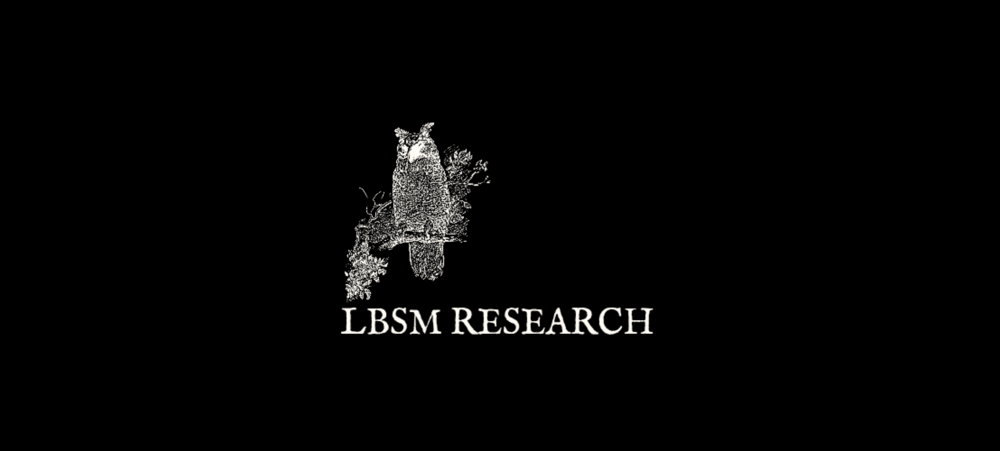

### Latent Behavioral Structure in Low-Dimensional Statistical Manifolds (LBSM)

LBSM is an experimental statistical machine learning research investigating whether latent behavioral structure and its temporal evolution in adaptive, autonomous, sequential systems exhibits structured low-dimensional latent organization despite high-dimensional observable dynamics. Reinforcement-guided synthetic agents are the current, controlled Phase 1 instantiation of this hypothesis — used because their regimes are known by construction — not the definition of its scope.

The project explores:
- latent behavioral structure discovery
- behavioral manifold formation
- temporal behavioral evolution
- adaptive/regime-driven dynamics (studied via reinforcement-guided synthetic agents in Phase 1)
- probabilistic behavioral inference
- statistical observability of adaptive, autonomous, sequential systems

---

## Core Hypothesis

Adaptive behavioral systems generate observable telemetry that occupies structured low-dimensional statistical manifolds rather than arbitrary high-dimensional space.

---

## Research Direction

LBSM studies:
- whether behavioral regimes naturally cluster in latent space
- whether adaptive/regime-driven dynamics (reinforcement-guided adaptation, in the Phase 1 synthetic agent) induces geometric structure
- whether behavioral drift manifests as manifold displacement
- whether temporal behavioral evolution admits compact statistical representations
- whether this structure and machinery generalize to real adaptive/autonomous/sequential systems beyond the synthetic construction

---

## Status

> Current experimental artifacts, telemetry outputs, and generated research assets.

#### 📓 Notebooks

- Notebook-01 — Telemetry Generation :

  

- Notebook-02 — Manifold Learning :

  

- Notebook-03 — HMM Inference :

  

- Notebook-04 — Anomaly Detection :

  

- Notebook-05 — RL Behavioral Evolution :

  

#### 🗂️ Datasets

- t2000 dataset (nb01) :

  

- trajectory & transition coords dataset (nb02) :

  
  

- hmm datasets: metrics and accuracy (nb03) :

- anomaly detection: threshold sweep and detection latency (nb04) :

- RL training log and learned policy summary (nb05) :

#### 📄 Reports

- Notebook-01 Report — Telemetry Generation & Latent Behavioral Structure Analysis :

  

- Notebook-02 Report — Manifold Learning & Latent Geometric Structures :

  

- Notebook-03 Report — HMM Inference & Unsupervised Regime Recovery :

  

- Notebook-04 Report — Online Anomaly Detection & Regime Shift Analysis :

  

- Notebook-05 Report — Reinforcement Learning & Behavioral Regime Reallocation :

  

---
