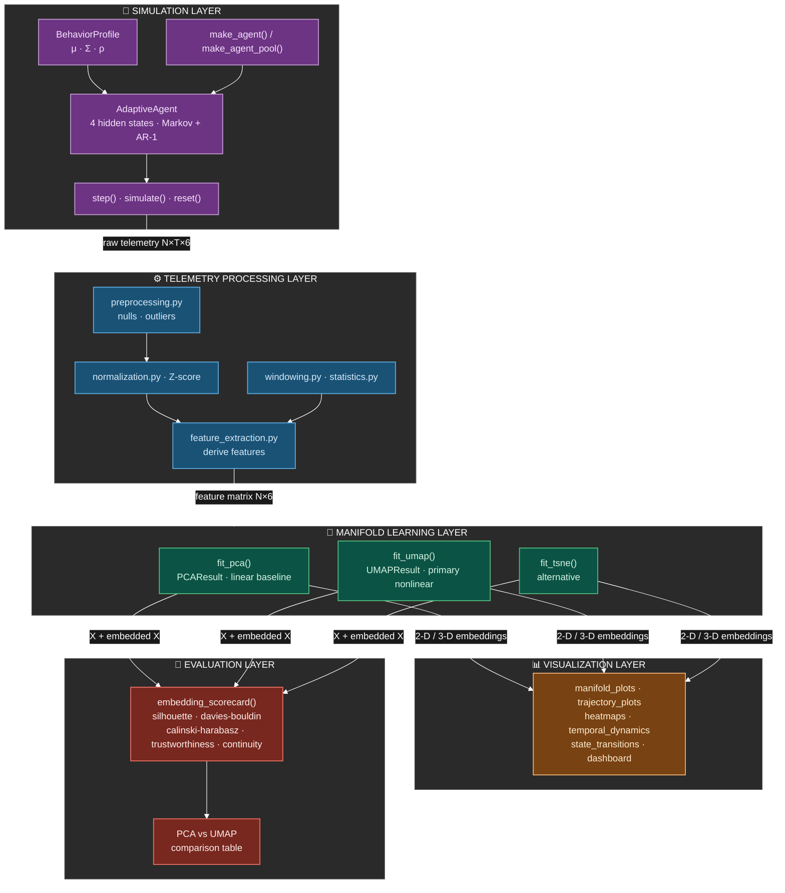
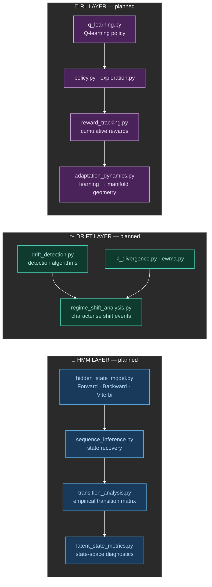
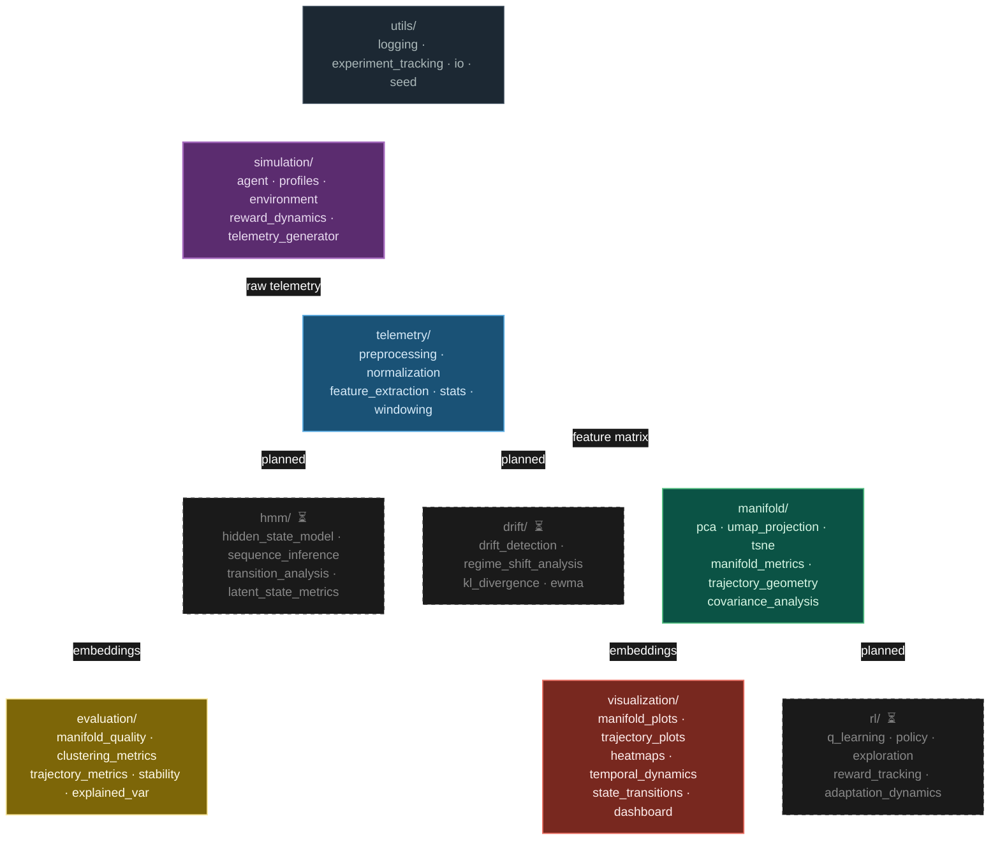
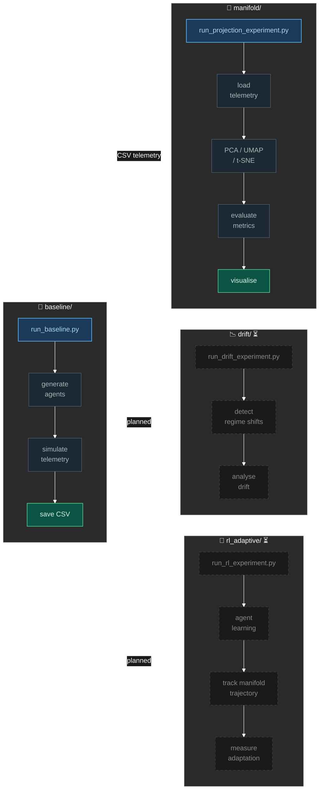
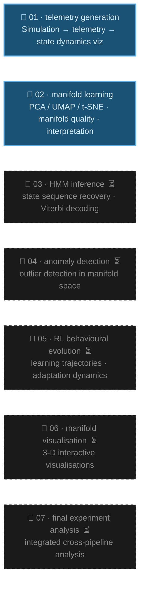

# LBSM Architecture

## 1 · Data flow & module interactions

---

## 2 · Parallel analysis branches (planned)

---

## 3 · Module dependency graph

---

## 4 · Temporal execution flow

```mermaid
%%{init: {"theme": "base", "themeVariables": {"primaryColor": "#1e1e2e", "primaryTextColor": "#ffffff", "primaryBorderColor": "#555", "lineColor": "#ffffff", "secondaryColor": "#2a2a2a", "tertiaryColor": "#2a2a2a", "background": "#0d0d0d", "mainBkg": "#2a2a2a", "nodeBorder": "#555", "clusterBkg": "#2a2a2a", "clusterBorder": "#555555", "titleColor": "#ffffff", "edgeLabelBackground": "#1a1a1a", "actorBkg": "#2a2a2a", "actorBorder": "#555", "actorTextColor": "#ffffff", "actorLineColor": "#ffffff", "signalColor": "#ffffff", "signalTextColor": "#ffffff", "labelBoxBkgColor": "#2a2a2a", "labelBoxBorderColor": "#555", "labelTextColor": "#ffffff", "loopTextColor": "#ffffff", "noteBkgColor": "#2a2a2a", "noteBorderColor": "#555", "noteTextColor": "#ffffff", "activationBkgColor": "#3a3a3a", "sequenceNumberColor": "#0d0d0d", "fontFamily": "monospace"}}}%%
sequenceDiagram
    autonumber
    participant A  as 🧬 Agent
    participant SM as 🔀 State Machine
    participant T  as 📡 Telemetry Store
    participant P  as ⚙️ Preprocessor
    participant E  as 🔭 Embedder
    participant V  as 📊 Visualiser
    participant Q  as 🧪 Evaluator

    rect rgb(60,20,80)
        Note over A,T: Simulation epoch
        A  ->> SM: current hidden state s_t
        SM ->> T:  sample x_t ~ N(μ_st, Σ_st) with AR-1
        T  ->> T:  record (agent_id, t, s_t, x_t)
        SM -->> SM: transition s_{t+1}
    end

    rect rgb(10,40,70)
        Note over P,Q: Analysis pipeline
        T  ->> P:  feature matrix X (N×6)
        P  ->> P:  normalise · handle missing data
        P  ->> E:  fit PCA, UMAP, t-SNE
        E  ->> Q:  silhouette · Davies-Bouldin · trustworthiness
        E  ->> V:  2D/3D scatter · trajectories · heatmaps
    end

    rect rgb(10,50,35)
        Note over A,Q: Planned downstream
        T  -->> SM: HMM — infer hidden state
        T  -->> P:  Drift — detect regime shifts
        E  -->> A:  RL — modify policies
        E  -->> Q:  Anomaly — outliers in manifold
    end
```

---

## 5 · Experiment pipeline

---

## 6 · Jupyter notebook pipeline

